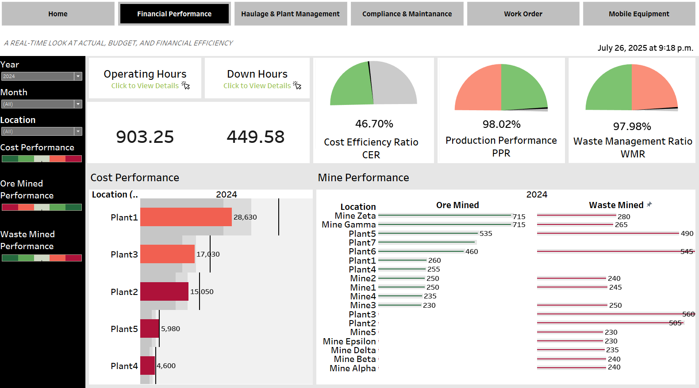

# Mining Financial Dashboard (Tableau)

## Overview
An executive dashboard visualizing financial KPIs across global mining operations. Built to support performance analysis and investment decision-making.

## Tools
- Tableau Desktop
- Excel or CSV for input data

## Features
- Financial performance analysis
- Profitability heatmaps by site
- Monthly trends and YoY comparisons
